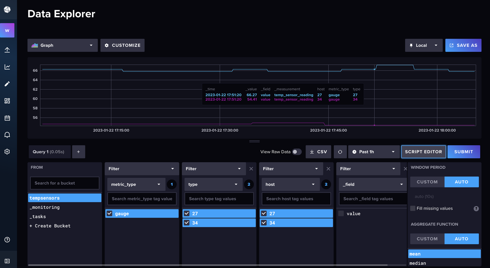
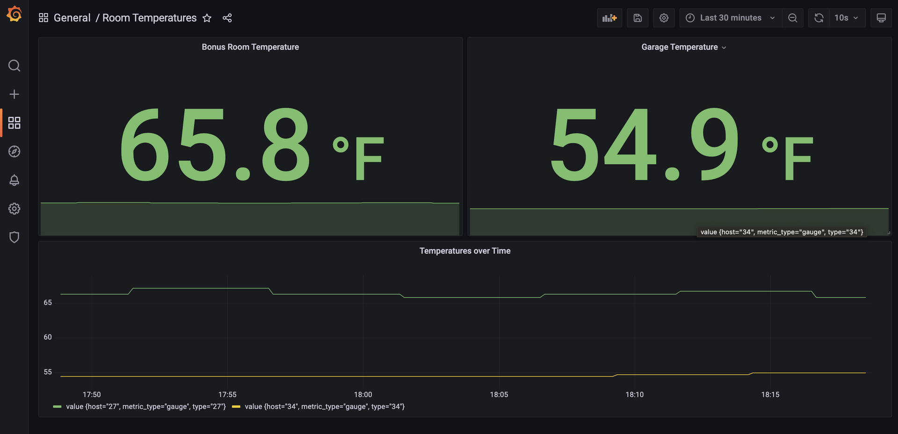

# Telegraf, InfluxDB, Grafana (TIG) Stack 


 <br/>
  <br/>


Practice project for learning how to use the TIG stack. 

## Project Inspiration

I started with [Hunter Johnston's](https://github.com/huntabyte) [TIG stack repo](https://github.com/huntabyte/tig-stack.git). I first watched [Hunter's video on YouTube](https://youtu.be/QGG_76OmRnA). The video is concise and has great information. Hunter communicates very clearly, and his YouTube channel looks like it has some great content.

I also used [Benjamin Cremer's](https://github.com/bcremer) [docker-telegraf-influx-grafana-stack repo](https://github.com/bcremer/docker-telegraf-influx-grafana-stack) as an example of how to provision a Grafana dashboard. I had started a simple python project for playing around with my Phillip's Hue motion sensor using the Hue API, so I used that app with statsd in a way similar to Benjamin's python metric producing python app.

## Try it out

Start the services.

```bash
docker-compose up -d
```

Run the python app. This assumes you have one or more Phillips Hue motion sensors. You'll need to update the `tig-stack/grafana/dashboards/temperatures.json` file so that it references the appropriate sensor IDs.

```bash
 python3 ./hue-temp-sensor/src/main.py \
   -b $BRIDGE_IP \
   -i $INTERVAL \
   -s 34,27 \
   -t $TELEGRAFIP \
   -tp $TELEGRAFPORT \
   -u $BRIDGEUSERNAME
```


## Interesting bits

[**Telegraf**](https://hub.docker.com/_/telegraf) / `1.19`

### telegraf.conf

There are many plugins available to use with Telegraf, and InfluxData has made it easy to find example configurations for many of the plugins that you can use. 

Some of the plugin types that you can use with Telegraf are inputs (I'm using statsd), processors and aggregators, and outputs (I'm using InfluxDB).

Look at the [telegraf.conf](./tig-stack/telegraf/telegraf.conf) to see how the [statsd input](./tig-stack/telegraf/telegraf.conf#L174) and the [InfluxDB output](./tig-stack/telegraf/telegraf.conf#L117) plugins are configured .

[**InfluxDB**](https://hub.docker.com/_/influxdb) / `2.6`

### InfluxDB Service's `entrypoint.sh`

The [entrypoint.sh script](./tig-stack/entrypoint.sh) is executed by docker-compose for the influxdb service. It creates the target bucket, sets the data retention time, the ORG, username and password, and sets the admin token. The admin token used was created using the openssl command:

```bash
openssl rand -hex 32
```

### InfluxDB Query Builder 

I ran the simple Python app that is using the statsd client to send data to Telegraf and ultimately into InfluxDB. I then went into the InfluxDB UI and used the Query Builder to help me create the queries needed to see the temperature data that was being sent from the Python app. 



Clicking on the "Script Editor" button will show the Flux queries that were built using the "Query Builder" view.

Here is an example of one of the Flux queries:

```sql
from(bucket: "tempsensors")
  |> range(start: v.timeRangeStart, stop: v.timeRangeStop)
  |> filter(fn: (r) => r["metric_type"] == "gauge")
  |> filter(fn: (r) => r["type"] == "27" or r["type"] == "34")
  |> filter(fn: (r) => r["host"] == "27" or r["host"] == "34")
  |> aggregateWindow(every: v.windowPeriod, fn: mean, createEmpty: false)
  |> yield(name: "mean")
```


[**Grafana-OSS**](https://hub.docker.com/r/grafana/grafana-oss) / `8.5.15`

### Creating the Dashboard

I created a simple dashboard in Grafana for displaying temperature readings from a couple of Phillips Hue motion sensors, and copied the JSON to [./tig-stack/grafana/dashboards/temperatures.json](./tig-stack/grafana/dashboards/temperatures.json) so the dashboard would be added to Grafana when the Grafana instance is brought up. 

```bash
grafana
├── dashboards
│   └── temperatures.json <---
└── provisioning
    ├── dashboards
    │   └── all.yml
    └── datasources
        └── influxdb.yml  
```

The [./tig-stack/grafana/provisioning/dashboards/all.yml](./tig-stack/grafana/provisioning/dashboards/all.yml) was taken from [Benjamin Cremer's example](https://github.com/bcremer/docker-telegraf-influx-grafana-stack/blob/latest/grafana/provisioning/dashboards/all.yml).

### Creating the Panels

The panels are populated with data from InfluxDB using the Flux queries I created in the InfluxDB UI. 



If you're familiar with SQL and/or Flink SQL, then it shouldn't be hard to figure out how to write future queries from scratch. However, using the InfluxDB Query Builder is probably the easiest option.

### Adding the InfluxDB datasource in Grafana

The InfluxDB-Flux datasource was added by creating the [./tig-stack/grafana/provisioning/datasources/influxdb.yml](./tig-stack/grafana/provisioning/datasources/influxdb.yml) file. 

```bash
grafana
├── dashboards
│   └── temperatures.json
└── provisioning
    ├── dashboards
    │   └── all.yml
    └── datasources
        └── influxdb.yml  <---
```

This file is a modified version of the [InfluxDB yaml file that Benjamin Cremer created](https://github.com/bcremer/docker-telegraf-influx-grafana-stack/blob/latest/grafana/provisioning/datasources/influxdb.yml). 

The main differences are:
- environment variables used for setting certain properties in the influxdb.yml file
- datasource name set to `influxdb-flux`
- jsonData.version property set to `flux`


