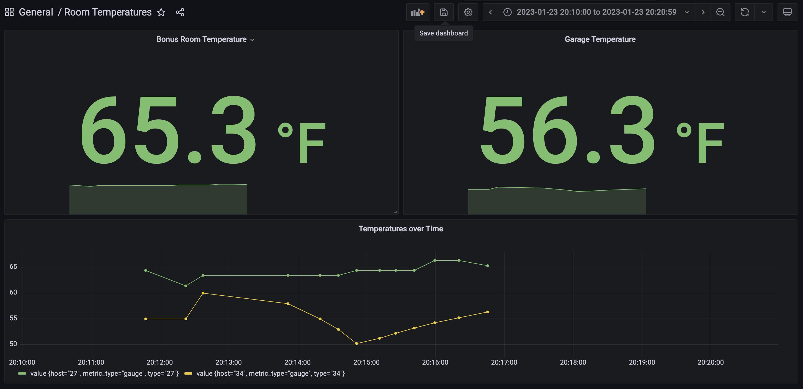

Based on these projects:

- https://github.com/huntabyte/tig-stack.git
- https://github.com/bcremer/docker-telegraf-influx-grafana-stack


## Test Input Added for Telegraf

I added the following configuration to the `telegraf.conf` file to add some example metrics to InfluxDB.

```yaml
[[inputs.file]]
  files = ["/etc/telegraf/metrics.in"]
  data_format = "influx"

[[outputs.file]]
  files = ["stdout"]
```

The `docker-compose.yml` file was updated to add the `test-metrics.in` file in the `/etc/telegraf/metrics.in` location.

View the sample metrics on a Mac using the following command:

```bash
docker-compose up -d; open http://localhost:3000/d/JlkNiHo4k/room-temperatures?orgId=1&from=1674533400000&to=1674534059000
```

A view of the dashboard with the sample metrics:



